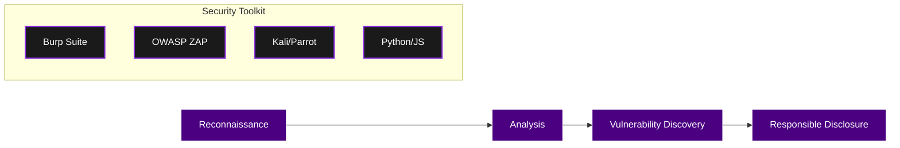

<h1 align="center">💀 Faza — Bug Hunter & Cybersecurity Explorer</h1>

  

  
  
  

---

## 🖤 About Me

Hi, I'm **Faza**, a passionate newbie bug hunter walking the dark corners of the web (ethically).  
Focused, curious, and always hungry to learn something new.

I break things responsibly, explore vulnerabilities, and constantly improve my craft.

---

## 🛠 Tech Stack & Hunting Workflow

---

## 🔥 Current Focus & Stats

| Category | Status | Target |
| :--- | :--- | :--- |
| **Bug Bounty** | 🟢 Learning | OWASP Top 10 |
| **Automation** | 🟡 Developing | Python Scrapers |
| **CTF / Labs** | 🟢 Active | HackTheBox / TryHackMe |
| **OS Security** | 🟢 Active | Linux Kernel Hardening |

---

## 🚀 Featured Projects

### 🗡 WhatsApp Bot (Baileys)
*Advanced automation engine.*
* Built with **Baileys (Node.js)**.
* Dynamic interaction & automated workflow.
* Scalable message handling architecture.

### 🇩🇪 German Language Roadmap
*Educational repository for LPK Standards.*
* Visualized using Mermaid.js.
* Focused on professional & technical vocabulary.

---

## 🛡 Security Philosophy

> "Security is not a product, but a process. Mastery is built through consistency and ethical responsibility."

---

## 🌐 Connect With Me

* ✉️ **Email:** `fazalia878@gmail.com`
* 🐦 **Twitter:** `@faza_handle`
* 🛠 **HackerOne:** *In Progress*

---

## 🕶 Fun Facts

* **Dark Mode Enthusiast:** I believe code looks better when the sun is down.
* **Forever Student:** If it's tech, I'm interested.
* **Methodical:** I don't just find bugs; I study why they exist.

<h3 align="center">⚡ Stay curious. Stay ethical. Keep hunting. ⚡</h3>

---
© 2026 FazaRoot — Built for Performance & Security

