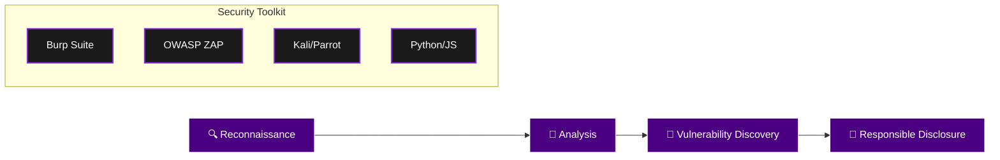

<div align="center">

<!-- Animated wave header -->


<!-- Typing animation -->
<a href="https://git.io/typing-svg">
  
</a>


</div>

---

## 🖤 About Me

```yaml
name: Faza
role: Bug Hunter & Cybersecurity Explorer
focus: [Web Security, OWASP Top 10, Automation, CTF]
motto: "Break things responsibly. Learn constantly."
currently_learning: "Advanced Web Exploitation"
```

Hi, I'm **Faza** 👋 — a passionate newbie bug hunter walking the dark corners of the web *(ethically, always)*.
Focused, curious, and always hungry to learn something new. I break things responsibly, explore vulnerabilities, and constantly sharpen my craft.

---

## 🛠 Tech Stack & Hunting Workflow

<div align="center">


</div>



---

## 🔥 Current Focus & Stats

| Category | Status | Target |
| :--- | :---: | :--- |
| **Bug Bounty** | 🟢 Learning | OWASP Top 10 |
| **Automation** | 🟡 Developing | Python Scrapers |
| **CTF / Labs** | 🟢 Active | HackTheBox / TryHackMe |
| **OS Security** | 🟢 Active | Linux Kernel Hardening |

---

## 📊 GitHub Analytics

<div align="center">


</div>

> 💡 Some cards may show zero data until your repos have public activity — that's normal for a fresh profile.

---

## 🐍 Contribution Snake

<div align="center">
  
</div>

> ⚙️ **Setup required** — this snake animation needs a GitHub Action to generate it. Instructions below ⬇️

---

## 🚀 Featured Projects

<table>
<tr>
<td width="50%" valign="top">

### 🗡 WhatsApp Bot (Baileys)
*Advanced automation engine.*
- Built with **Baileys (Node.js)**
- Dynamic interaction & automated workflow
- Scalable message handling architecture

</td>
<td width="50%" valign="top">

### 🇩🇪 German Language Roadmap
*Educational repository for LPK Standards.*
- Visualized using **Mermaid.js**
- Focused on professional & technical vocabulary

</td>
</tr>
</table>

---

## 🛡 Security Philosophy

<div align="center">

> *"Security is not a product, but a process.*
> *Mastery is built through consistency and ethical responsibility."*

</div>

---

## 🌐 Connect With Me

<div align="center">

[](mailto:fazalia878@gmail.com)
[](https://twitter.com/faza_handle)
[](https://hackerone.com)

</div>

---

## 🕶 Fun Facts

- 🌙 **Dark Mode Enthusiast:** I believe code looks better when the sun is down.
- 📚 **Forever Student:** If it's tech, I'm interested.
- 🔬 **Methodical:** I don't just find bugs; I study why they exist.

<div align="center">
<h3>⚡ Stay curious. Stay ethical. Keep hunting. ⚡</h3>


<sub>© 2026 FazaRoot — Built for Performance & Security</sub>

</div>
